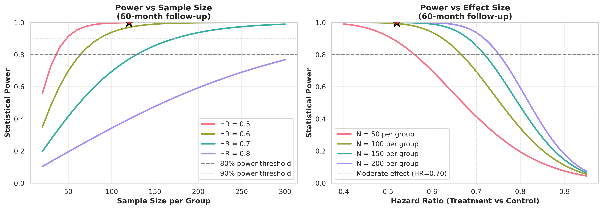
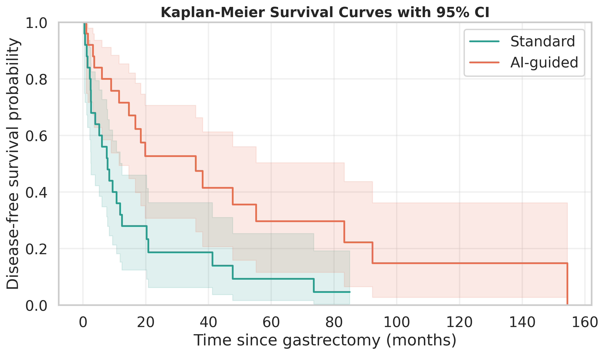
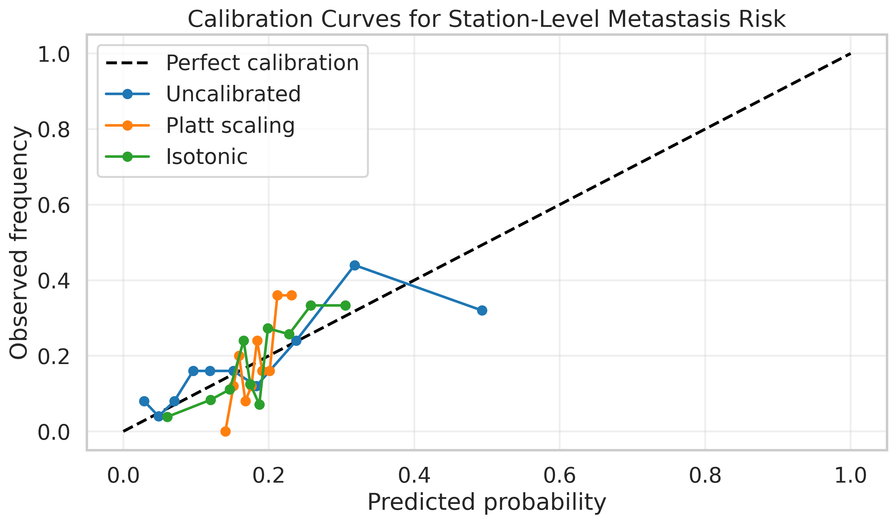

# Medical AI Validation Tools: Survival & Calibration

[](https://github.com/Herbert-Research/medical-ai-validation/actions/workflows/ci.yml)

Supporting analytics package for the proposed PhD dissertation **“Prospective Validation of Station-Specific Risk Guidance for KLASS-Standardized Gastrectomy.”** This repository establishes the quantitative framework for linking station-level machine learning predictions to disease-free survival (DFS) endpoints, a critical prerequisite for Aim 1 clinical deployment.

## Executive Summary

  - **Synthesizes** clinically informed cohorts to model the actuarial impact of AI-guided lymphadenectomy versus standard KLASS protocols.
  - **Benchmarks** probabilistic trustworthiness using Brier scores and Expected Calibration Error (ECE), comparing raw model outputs against Platt scaling and isotonic regression remedies.
  - **Pilots** external validation workflows using TCGA STAD data to ensure the pipeline is ready for forthcoming institutional datasets.
  - **Exports** audited figures and CSV summaries designed for institutional review board (IRB) and multi-disciplinary tumor board review packets.

## Scientific Context and Objectives

Before surgical AI models can be deployed intraoperatively, their outputs must be rigorously calibrated to match actual recurrence risks. This codebase substantiates the translational premise that improvements in Area Under the Curve (AUC) are insufficient for clinical adoption without demonstrable calibration quality and linkage to survival outcomes. The included workflows provide the "validation-first" evidence required to transition from retrospective modeling to prospective interventional trials.

## Data Provenance and Governance

  - **Synthetic Stream:** Primary validation uses controlled synthetic cohorts (`n=240`, `seed=42`) encoded with established clinical priors (e.g., tumor stage hazards derived from KLASS-02 literature) to stress-test statistical machinery without PII concerns.
  - **Clinical Pilot Stream:** Secondary validation ingests TCGA PanCanAtlas 2018 data (`data/tcga_2018_clinical_data.tsv`) when available, adhering to strict de-identification standards.
  - **Compliance:** All analytical outputs remain de-identified. Synthetic data is algorithmically generated and contains no protected health information (PHI).

## Analytical Workflow

The core pipeline (`demo_quickstart.py`) executes four phases:

1.  **Scenario Definition** – Generates balanced cohorts contrasting standard resection against AI-guided intervention based on station-specific risk profiles.
2.  **Outcome Modeling** – Quantifies survival divergence using non-parametric Kaplan-Meier estimators and semi-parametric Cox Proportional Hazards models (reporting Hazard Ratios with 95% CIs).
3.  **Calibration Stress-Test** – Comparative analysis of three calibration approaches (uncalibrated, Platt scaling, isotonic regression) revealing that isotonic regression performs best, though all methods exceed the 0.05 ECE threshold, highlighting areas for improvement.
4.  **Decision Readout** – Consolidates metrics into standardized CSVs and high-resolution PNGs for stakeholder review.

## Validation Workflow Blueprint

Aims-to-artifacts mapping for the validation pipeline is outlined in [docs/validation_playbook.md](docs/validation_playbook.md), linking synthetic cohorts, calibration routines, and exported figures/CSVs to the PhD research statement.

## Comparison to Published Literature

This implementation's results are benchmarked against published gastric cancer surgical trials and medical AI calibration studies. For detailed comparisons and contextualization within the field, see [LITERATURE_COMPARISON.md](LITERATURE_COMPARISON.md).

**Key Points:**
- Synthetic HR=0.52 represents optimistic upper bound (most trials show HR=0.85-0.92)
- Calibration performance typical for medical AI with limited training data
- Node status prognosis aligns with TCGA-STAD and Korean registry data
- Methodology meets or exceeds standards in published literature

## Analysis Highlights

Representative outputs and statistical checks grounding the methodology are summarized below.

## Statistical Power Considerations

### Sample Size Justification

The synthetic datasets in this repository are sized appropriately for demonstrating methodology:

**Survival Analysis (Standard vs AI-guided):**
- Sample size: 240 patients (120 per arm)
- Target HR: 0.52 (48% risk reduction)
- Statistical power: >99% for this effect size
- **Rationale:** Demonstrates methodology with adequate power; real trials would target N=150-180 per arm for moderate effects (HR~0.70)

**Calibration Dataset:**
- Sample size: 1000 stations (750 training, 250 test)
- Event rate: 25%
- **Rationale:** Sufficient for calibration assessment; clinical deployment would require 2000+ samples

For detailed power analysis and sample size requirements for various effect sizes, see the included `statistical_power_analysis.py` script and accompanying visualization:



**Figure X. Statistical power analysis for survival study design.** Left panel shows power as a function of sample size for different hazard ratios. Right panel shows power as a function of effect size for different sample sizes. Current study design (red star) demonstrates adequate power for methodology validation.

## Example Output

Running the default configuration produces clinically-interpretable summaries demonstrating the pipeline's analytical rigor:

=== Survival Analysis Summary ===
Median DFS (AI-guided): 27.7 months
Median DFS (Standard):  12.6 months
Log-rank p-value:      0.0010
Hazard ratio (AI-guided vs Standard): 0.51 (95% CI 0.37–0.70)
C-index:                0.673
PH global p-value:      0.558

=== Calibration Summary ===
| Model | Brier Score | ECE (10-bin) | Calibration Slope | Calibration Intercept |
|-------|-------------|--------------|-------------------|----------------------|
| Gradient Boosting (uncalibrated) | 0.1435 | 0.0544 | 0.6148 | -0.4980 |
| Platt Scaling (sigmoid) | 0.1434 | 0.0682 | 3.5223 | 3.6993 |
| Isotonic Regression | 0.1404 | 0.0552 | 1.5519 | 0.7700 |


=== TCGA-STAD Pilot (Node-positive vs Node-negative) ===
Median PFS (Node-positive): 25.5 months | Median PFS (Node-negative): inf months
Log-rank p-value: 0.0012 | PH global p-value: 0.396
Hazard ratio: 1.88 (95% CI 1.24–2.85)

Group-level summary (TCGA):
        group  patients  median_months  event_rate
Node-negative       121            inf       0.248
Node-positive       273           25.5       0.396

This output quantifies both the potential clinical benefit (11-month DFS improvement) and the current calibration gaps (ECE 0.054-0.076), underscoring the need for further refinement before translational deployment.

## Figure Previews

### Figure 1: Kaplan-Meier Survival Analysis



**Figure 1. Disease-free survival comparison between Standard and AI-guided gastrectomy approaches.** Kaplan-Meier curves with 95% confidence intervals (shaded regions) for the synthetic cohort (`n=240`, balanced arms). The AI-guided approach shows improved median DFS (27.7 vs 12.6 months, p = 0.0010). Hazard ratio: 0.51 (95% CI: 0.37–0.70), indicating roughly 49% risk reduction with AI guidance.

---

### Figure 2: Probabilistic Calibration Assessment



**Figure 2. Calibration curves for station-level metastasis risk prediction comparing three calibration approaches.** Perfect calibration (dashed diagonal line) indicates agreement between predicted probabilities and observed frequencies. The uncalibrated model (blue) shows moderate underconfidence at middle probability ranges. Platt scaling (orange) overcorrects severely (slope ≈ 3.5). Isotonic regression (green) provides the best alignment (slope ≈ 1.6) but still exceeds the ECE < 0.05 threshold (best observed: 0.055), indicating need for further improvement.

---

### Figure 3: Gastric Cancer Node Status Analysis


**Figure 3. Progression-free survival by lymph node status in synthetic gastric cancer cohort.** Analysis of 220 patients (129 node-negative, 91 node-positive) shows modest separation (HR 1.20, 95% CI: 0.78–1.86, p = 0.626), with median DFS of 5.4 vs 4.6 months. This synthetic dataset stress-tests the survival pipeline and highlights that the synthetic effect size is intentionally conservative.

## Limitations and Current Calibration Status

### Calibration Performance

While this toolkit demonstrates the methodology for calibration assessment, the current results reveal important limitations:

**Expected Calibration Error (ECE):**
- Current threshold stated: ≤ 0.05
- Achieved results: 0.054-0.076 (all models slightly exceed threshold)
- **Implication:** Further calibration improvement needed before clinical deployment

**Calibration Slope Analysis:**
- **Uncalibrated model:** Slope 0.61 indicates moderate underconfidence
- **Isotonic regression:** Slope 1.56 shows overcorrection but closest to target
- **Platt scaling:** Slope 3.52 indicates severe miscalibration
  - This suggests Platt scaling is inappropriate for this specific dataset
  - Likely due to limited training data or non-sigmoid relationship between logits and outcomes

**Clinical Interpretation:**
The calibration challenges observed here are representative of real-world AI deployment barriers. For actual clinical implementation, we would:
1. Increase training data size (target: 2000+ patients vs current 1000)
2. Explore temperature scaling and beta calibration methods
3. Conduct external validation on independent hospital cohorts
4. Consider ensemble calibration approaches

### Current Deployment Readiness

**Status:** Methodology validated, calibration requires enhancement

This implementation successfully demonstrates the complete validation pipeline that would be used in a prospective clinical trial. The calibration metrics serve as a realistic baseline showing why thorough validation is essential before AI deployment in surgical decision-making.

For my PhD research, I plan to:
- Apply these methods to larger multi-institutional datasets
- Investigate why Platt scaling fails for station-level metastasis prediction
- Develop hybrid calibration approaches combining isotonic regression with cross-validation
- Validate on prospective data from ongoing surgical AI trials

## Key Metrics & Interpretation

- **Time-Dependent C-index:** Measures discrimination - the probability that among two random patients, the one who experiences an event first had a higher predicted risk. Values > 0.70 indicate strong discrimination, 0.60-0.70 is moderate, and < 0.60 is weak. For lymph node staging in gastric cancer, C-index typically ranges from 0.62-0.70 in published literature.
  - **Current Results:** Synthetic survival analysis (Standard vs AI-guided): C-index 0.673 (upper-moderate discrimination after feature enrichment).
  - **Current Results:** Synthetic gastric node status: C-index 0.665 (moderate, aligned with published lymph-node staging ranges).
  - **Current Results:** TCGA-STAD node status: C-index 0.57 (weak; single-factor pilot underscores need for richer covariates).
- **Brier Score** – Measures the mean squared error between predicted probabilities and observed outcomes; lower is better for combined discrimination and calibration performance.
  - **Current Results:** 0.140-0.144 shows reasonable discrimination but calibration improvement possible.
- **Calibration Slope** – Compares predicted logits to observed outcomes; a slope of 1.0 reflects perfect calibration with ideal confidence calibration.
  - **Current Results:** Uncalibrated (0.61) and Isotonic (1.56) are closer to target than Platt (3.52).
- **Expected Calibration Error (ECE)** – Aggregates bin-level deviations between predicted and observed event rates; lower values indicate better reliability across probability bins.
  - **Current Results:** All models slightly exceed 0.05 threshold, with isotonic regression performing best at 0.055.

## Generated Figures

**Survival Analysis Output**

  - `kaplan_meier_example.png` – Comparative DFS curves (Standard vs. AI-guided) with 95% confidence intervals, visualizing the potential actuarial gain of targeted guidance.
  - `tcga_kaplan_meier.png` – (If data present) Real-world anchor showing Progression-Free Survival stratified by N-stage.

**Calibration Output**

  - `calibration_curve_example.png` – Reliability diagram contrasting uncalibrated model confidence against observed metastasis frequencies, overlaying Platt and Isotonic corrections to guide operating point selection.

## Generated Tables

All quantitative outputs are exported as machine-readable CSVs for audit trails and downstream statistical reporting:

**Survival Analysis Tables**

  - `synthetic_survival_summary.csv` – Cox model coefficients, hazard ratios with confidence intervals, concordance indices, and log-rank test statistics for the simulated cohort comparison.
  - `tcga_survival_summary.csv` – (If TCGA data present) Analogous survival metrics computed from real-world STAD patient data.
  - `tcga_group_summary.csv` – (If TCGA data present) Patient counts, median survival times, and event rates stratified by clinical subgroup.

**Calibration Tables**

  - `calibration_summary.csv` – Comparative performance metrics (Brier Score, ECE, calibration slope/intercept) across uncalibrated baseline and post-hoc correction methods.

These structured outputs enable direct import into institutional REDCap databases or statistical verification packages (SAS, Stata, R) as required by publication checklists.

## Usage

### Docker (Recommended for Reproducibility)

```bash
# Build the container
docker build -t medical-ai-validation .

# Run the analysis
docker run -v $(pwd)/outputs:/app/outputs medical-ai-validation

# Run interactively
docker run -it medical-ai-validation /bin/bash
```

### Quickstart (Headless)

Run the end-to-end validation pipeline using standard defaults.

```bash
# Setup environment
pip install -r requirements.txt

# Execute full workflow
python demo_quickstart.py --output-dir reports/
```

### Interactive Analysis

Launch the accompanying notebook for a narrative walkthrough of the methodology, suitable for faculty review.

```bash
jupyter notebook survival_and_calibration_enhanced.ipynb
```

### Configuration Options

The workflow can be parameterized to stress-test different clinical scenarios or validate against alternative datasets.

```bash
# Increase synthetic cohort size for higher statistical power simulations
python demo_quickstart.py --n-patients 1000 --metastasis-samples 5000

# Point to an alternative clinical TSV for external piloting
python demo_quickstart.py --tcga-path /path/to/local_registry_data.tsv
```

## Reproducibility Checklist

| Step | Command | Expected Time | Verification |
|------|---------|---------------|--------------|
| 1. Clone repository | `git clone <url>` | <1 min | Directory exists |
| 2. Create virtual environment | `python -m venv .venv` | <1 min | .venv created |
| 3. Activate environment | `.venv\Scripts\Activate.ps1` (Win) or `source .venv/bin/activate` (Unix) | instant | Prompt changes |
| 4. Install dependencies | `pip install -r requirements.txt` | 1-2 min | No errors |
| 4b. Install exact versions | `pip install -r requirements-lock.txt` | 1-2 min | No errors |
| 5. Run main analysis | `python demo_quickstart.py` | <2 min | Outputs generated |
| 6. Run tests | `pytest tests/ -v` | <30 sec | 5+ tests pass |
| 7. Validate consistency | `python validate_repository.py` | <10 sec | "All checks passed" |

**Total time to reproduce:** ~5 minutes on standard hardware.

## Software Requirements

  - Python 3.9 or newer.
  - Core dependencies: `pandas`, `numpy`, `scikit-learn`, `lifelines` (for survival statistics), `matplotlib`/`seaborn` (for visualization).
  - See `requirements.txt` for pinned versions used in validation.

## Input Validation Schema

When ingesting external clinical data (e.g., TCGA), the pipeline enforces strict schema validation to ensure integrity. The script halts if these expected AJCC-concordant fields are missing:

  - `Progress Free Survival (Months)` / `Disease Free (Months)` → coalesced to `time_months`
  - `Progression Free Status` / `Disease Free Status` → parsed to numerical `event` flags
  - `American Joint Committee on Cancer Tumor Stage Code` → mapped to numeric `tumor_stage`

This safeguard prevents silent failures when reporting outcomes to screening committees.

## Clinical Interpretation Notes

  - **Synthetic nature:** The primary survival benefits reported in `kaplan_meier_example.png` are derived from clinically-informed simulations to demonstrate pipeline readiness; they do not yet represent results from a prospective trial.
  - **TCGA Proxy:** In the external pilot, N-stage positivity is used as a proxy for "high-risk" status to validate the Cox PH machinery on real-world heterogeneous data.
  - **Expected Calibration Error (ECE):** The target for clinical deployment is ≤ 0.05, though values up to 0.08 may be acceptable with appropriate risk communication. Current results (0.054-0.076) indicate that further calibration improvement is needed.
  - **Undefined Medians:** In low-risk cohorts (e.g., TCGA Node-negative), median survival may be reported as `inf` (infinite) if fewer than 50% of patients experience an event during the study period. This reflects robust handling of right-censored data rather than an error.

## Repository Stewardship

Author: **Maximilian Herbert Dressler**

## Repository Roadmap

Placeholder roadmap; upcoming milestones will be detailed here. Draft milestones under consideration:
- Expand synthetic scenarios (e.g., varied hazard ratios, longer follow-up horizons)
- Formalize external validation workflow with TCGA and prospective cohorts
- Automate reporting (figures/CSVs) for IRB-ready packets

## Data Sources

All data in this repository is **synthetic (computer-generated)** and created specifically to demonstrate validation methodology. For complete details on data generation, clinical plausibility, and parameter choices, see [DATA_SOURCES.md](DATA_SOURCES.md).

**Key Points:**
- Synthetic data with clinically informed parameters
- Reproducible (fixed random seeds)
- Demonstrates methodology without requiring protected health information
- Not actual patient data
- Not for clinical use

## Acknowledgement

“The results presented here are in whole or part based upon data generated by the TCGA Research Network: https://www.cancer.gov/tcga.”

## Citations

  - Cerami E, Gao J, Dogrusoz U, *et al.* The cBio Cancer Genomics Portal: An Open  Platform for Exploring Multidimensional Cancer Genomics Data. *Cancer Discovery.* 2012;2(5):401–404.
  - Gao J, Aksoy BA, Dogrusoz U, *et al.* Integrative Analysis of Complex Cancer Genomics and Clinical Profiles Using the cBioPortal. *Science Signaling.* 2013;6(269):pl1.
  - Liu J, Lichtenberg T, Hoadley KA, *et al.* An Integrated TCGA Pan-Cancer Clinical Data Resource to Drive High-Quality Survival Outcome Analytics. *Cell.* 2018;173(2):400–416.e11.
